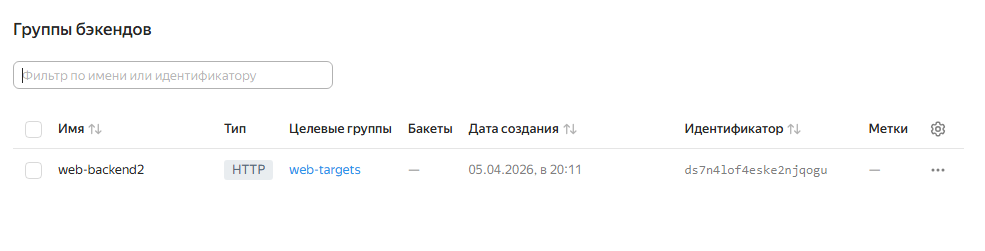

#  Дипломная работа по профессии «Системный администратор» - Александров Александр

---------

## Задача
Ключевая задача — разработать отказоустойчивую инфраструктуру для сайта, включающую мониторинг, сбор логов и резервное копирование основных данных. Инфраструктура должна размещаться в [Yandex Cloud](https://cloud.yandex.com/) и отвечать минимальным стандартам безопасности: запрещается выкладывать токен от облака в git. Используйте [инструкцию](https://cloud.yandex.ru/docs/tutorials/infrastructure-management/terraform-quickstart#get-credentials).


### 1.	Структура проекта

```
terraform/
 ├── main.tf
 ├── variables.tf
 ├── terraform.tfvars
```

**Переменные (токен не в git!)**

**variables.tf**

```
variable "yc_token" {}
variable "cloud_id" {}
variable "folder_id" {}
```

**terraform.tfvars**

```
yc_token  = "TOKEN"
cloud_id  = "CLOUD_ID"
folder_id = "FOLDER_ID"
```

[main.tf](terraform/main.tf)
[variables.tf](terraform/variables.tf)
[terraform.tfvars](terraform/terraform.tfvars)


### Яндекс консоль

**Консоль Yandex Cloud**


**Виртуальные машины**


**VPS**


**Подсети**


**Целевые группы**


**Балансировщик**


**Роутер**


**Backend**




### 2. Сеть (VPC, подсети, NAT)

Создана единая VPC сеть с разделением на публичную и приватные подсети (terraform, публичная подсеть, приватные подсети, nat gateway, bastion host).

Bastion host 
ssh ubuntu@ 89.169.131.105 (подключение через публичный IP)


WEB сервера
Созданы две ВМ в разных зонах без публичного IP


**Ansible (nginx)**

**inventory.ini**

```
[web]
web1.ru-central1.internal
web2.ru-central1.internal
```

**nginx.yml**

```
- hosts: web
  become: yes

  tasks:
    - name: install nginx
      apt:
        name: nginx
        state: present
        update_cache: yes

    - name: start nginx
      service:
        name: nginx
        state: started
        enabled: yes
```

ansible-playbook -i inventory.ini nginx.yml


### 3. LOAD BALANCER (YC CLI)

[Балансировщик](http://158.160.236.105/)

### 4. Zabbix


**Доступ к панели** 

[Zabbix](http://62.84.113.117/zabbix)

логин - Admin, пароль - zabbix

Настроен дашборд Инфраструктура Диплома, добавлены триггеры

### 5. ELK (Docker)

**Elastic**


**Kibana**


[Elastic](http://62.84.112.228:5601/app/discover) 

**Elasticsearch**

```
sudo docker run -d \
  --name elasticsearch \
  -p 9200:9200 \
  -e "discovery.type=single-node" \
  docker.elastic.co/elasticsearch/elasticsearch:8.12.2
```

**Kibana**

```
sudo docker run -d \
  --name kibana \
  -p 5601:5601 \
  -e ELASTICSEARCH_HOSTS=http://10.10.4.x:9200 \
  docker.elastic.co/kibana/kibana:8.12.2
```

**Filebeat (web1/web2)**

```
sudo docker run -d \
  --name filebeat \
  --restart always \
  -v $(pwd)/filebeat.yml:/usr/share/filebeat/filebeat.yml \
  -v /var/log/nginx:/var/log/nginx \
  docker.elastic.co/beats/filebeat:8.12.2
```

### 6. SECURITY GROUPS

Ограничен доступ только к необходимым портам
•	Bastion → 22 
•	Web → 80 + SSH только с bastion 
•	Zabbix → 80 
•	Kibana → 5601 
•	Elastic → 9200 (внутри сети)

### 7. Настроен BACKUP, снимки дисков


### 8. ИТОГ

В рамках работы реализована отказоустойчивая инфраструктура:
•	изолированная сеть (VPC) 
•	bastion host 
•	балансировка нагрузки 
•	мониторинг (Zabbix) 
•	логирование (ELK) 
•	резервное копирование 
Все компоненты соответствуют требованиям безопасности

